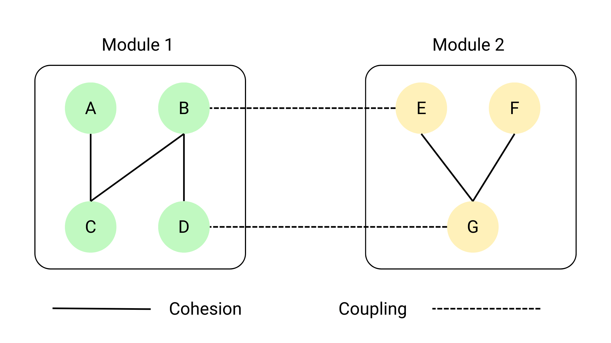
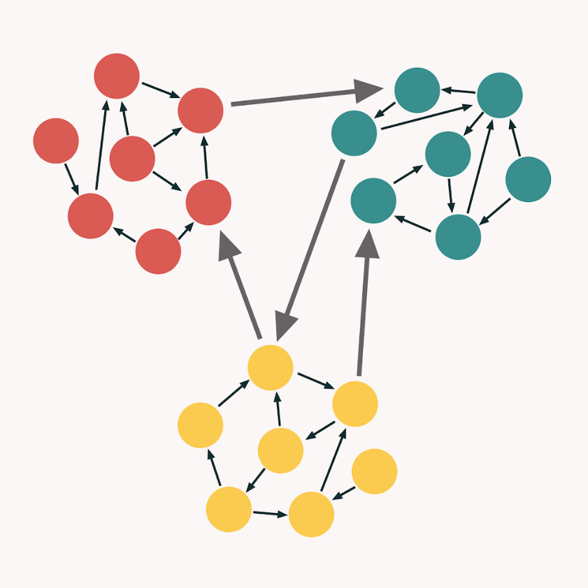

# Coupling and cohesion

## Cohesion (сцепление), better -> high
> Степень, в которой часть кодовой базы образует логически единую атомарную единицу и не может быть легко разделен
на более маленькие части.

## Coupling (связанность), better -> low
> Степень взаимосвязи между блоками. Другими словами, это количество соединений между двумя или более блоками.

> Идеальный код с низким coupling и высоким cohesion

## How to check cohesion?

> - Определить ответственности класса. Какова его главная цель и что он должен делать?
> - Проанализировать методы класса. Они все относятся к одной и той же цели или они выполняются несвязанные задачи?
> - Проверить, что методы в классе используют одни переменные или разделяют общую функциональность. Они полагаются друг
на друга при выполнении задач?
> - Определить, нет ли дублирования кода или методов с похожими структурами.
> - Убедиться, что класс понятную и единую ответственность.

## Cohesion best practices

> - Каждый класс должен иметь единую ответственность и все его данные и методы должны иметь отношение к ней.
> - Инкапсулировать данные и методы, которые относятся друг к другу в один класс. Это помогает поддерживать и понимать его.
> - Целиться на проектирование системы, как на коллекцию маленьких, переиспользуемых модулей, каждый - с собственным
cohesion.
> - Использовать паттерны.

## How to check coupling?

> - Взглянуть на другие классы, которые используется в определенном классе. Если класс зависит от множества других - то
это может сказать о высокой степени связанности.
> - Посчитать количество методов, вызванных между классами. Много - плохо.
> - Определить уровень абстракции, на котором общаются классы. Низкий - плохо.

## Coupling best practices

> - Использовать интерфейсы вместо конкретных реализаций.
> - Использовать DI.
> - Использовать, например, Фасад или Адаптер для того, чтобы предоставить общий интерфейс для взаимодействия с множеством
объектов.
> - Использовать инкапсуляцию для лимитирования видимости данных и методов, и не выставлять наружу детали реализации.
Делая это, можно уменьшить количество зависимостей между объектами и сделать легче их изменение и расширение без
задевания других частей системы.