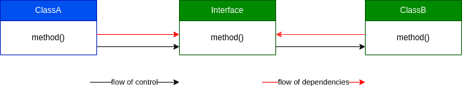
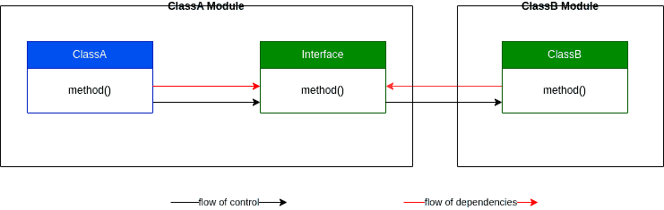

# Dependency inversion principle (DIP)

## IDEA
> 1) Модули верхних уровней не должны зависеть от модулей нижних уровней. Оба типа модулей должны зависеть
> от абстракций.
> 2) Абстракции не должны зависеть от деталей. Детали долждны зависеть от абстракций.

> Имея следующую диаграмму классов, можно сказать, что `high-level module` `(Class A)` зависит от `low-level module`
> `(Class B)`, что противоречит принципу и не позволяет подставлять под класс B что угодно и легко тестировать
> их взаимодействие.
> 

> Поэтому необходимо добавить уровень абстракции между ними - интерфейс, от которого будут зависеть оба модуля (класса).
> 

> В случае реальных модулей, интерфейс необходимо поместить в `high-level module`, потому что иначе он будет зависеть от
> `low-level module`.

