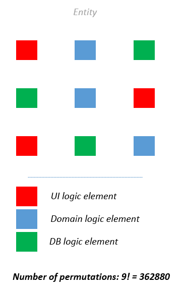
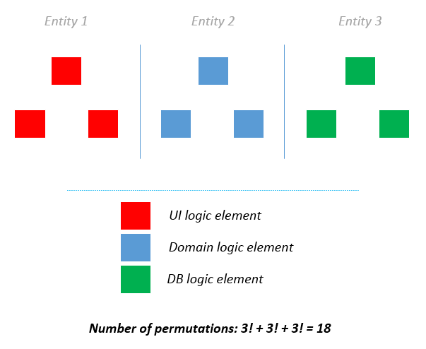

# Separation of concerns (SoC)

## IDEA
> Если в классе имеется множество разных зависимостей, их очень сложно постоянно держать в уме и контролировать, потому
> что их комбинация будет только расти. Поэтому лучше разделять ответственность в пользу меньшего количество комбинаций
> между зависимыми классами.

 